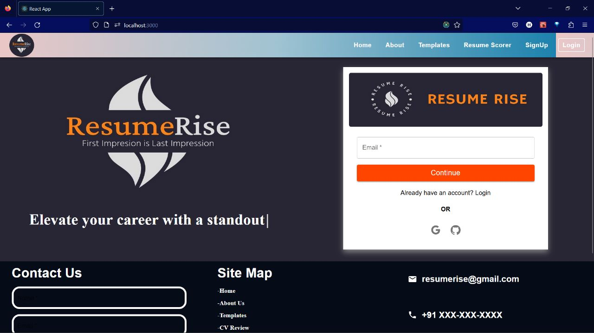
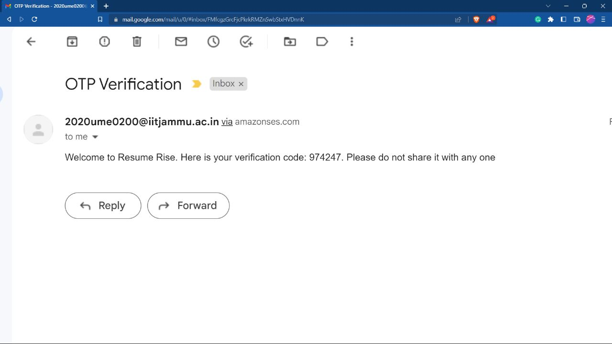
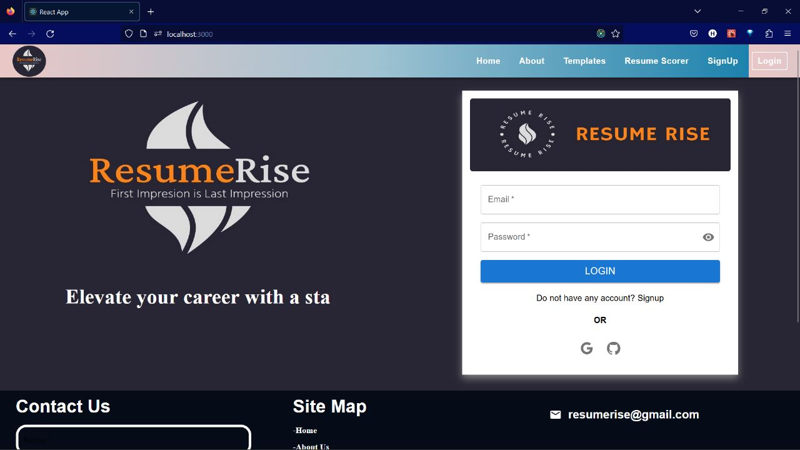
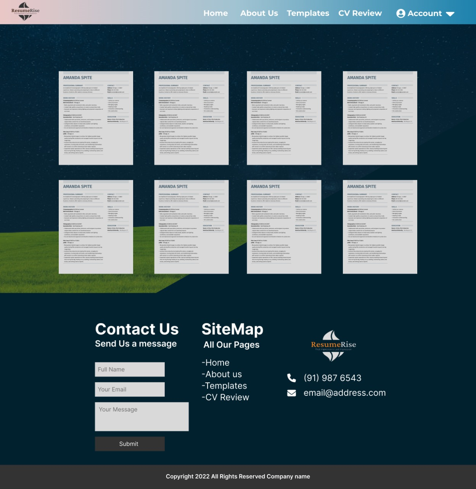
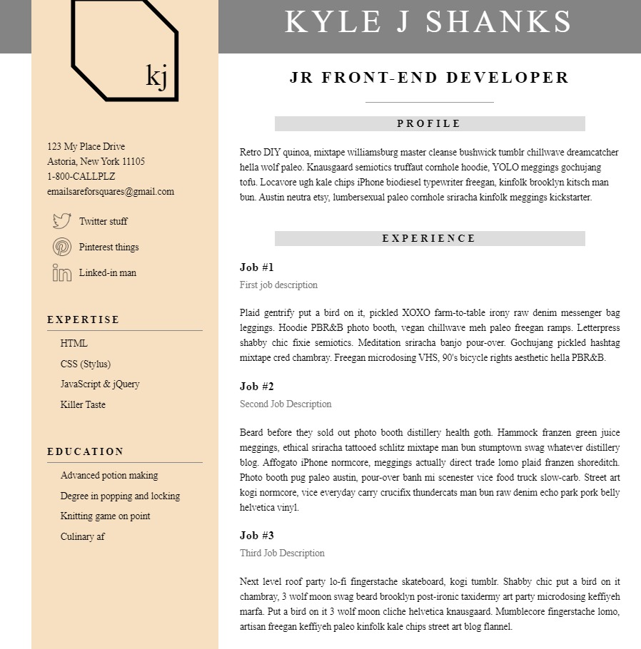
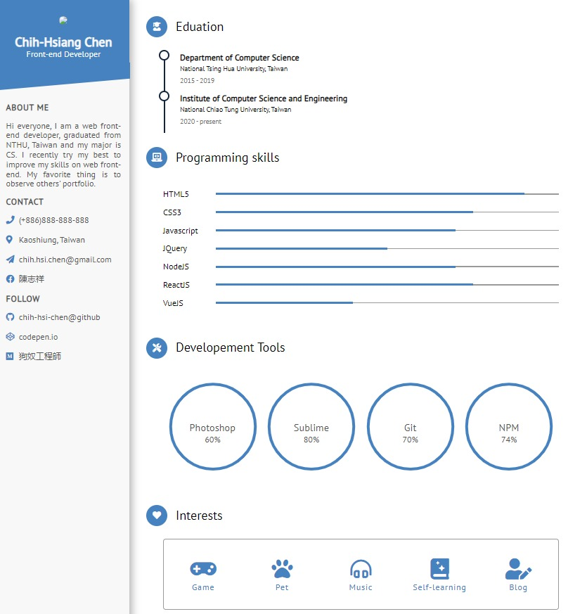
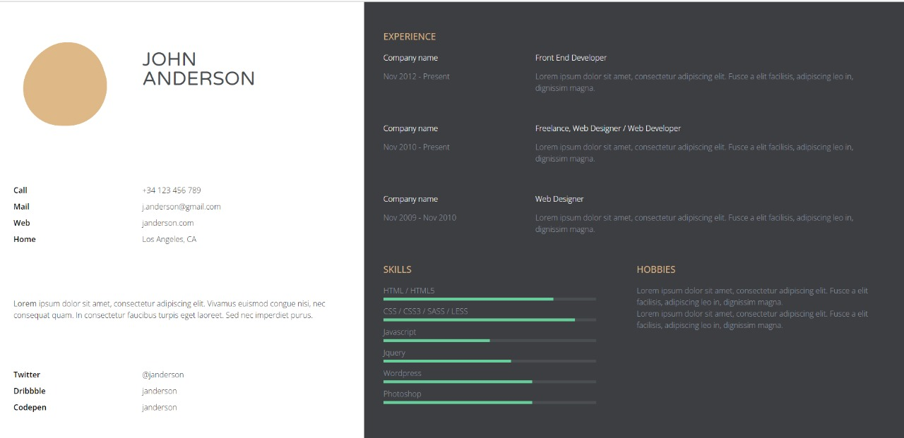
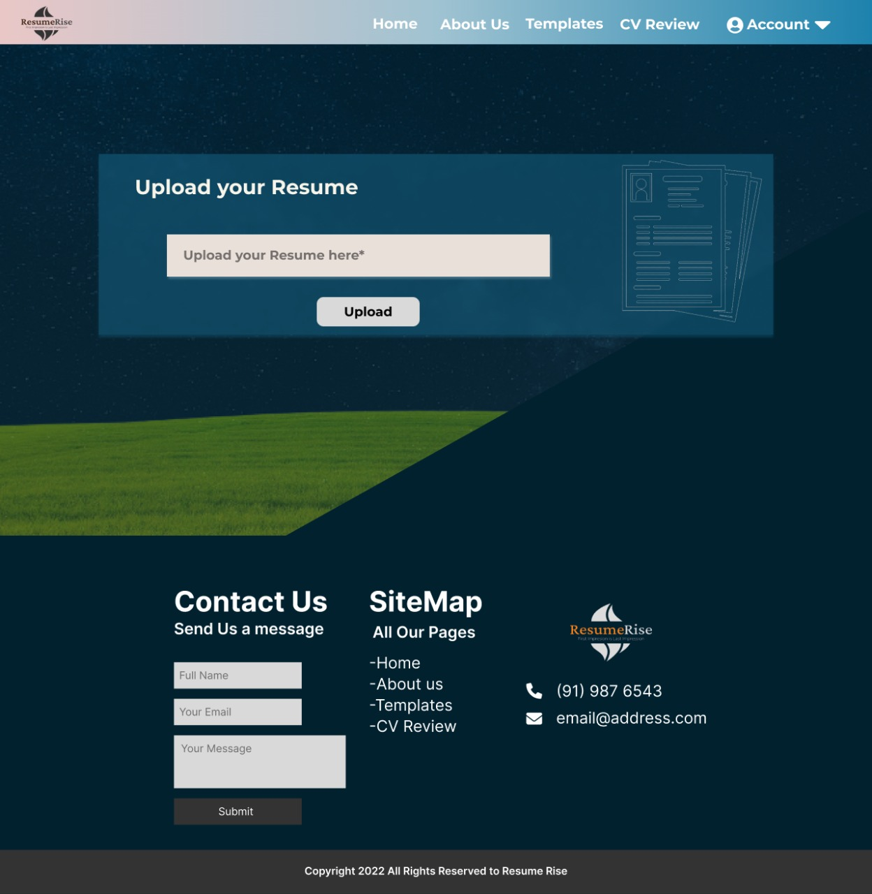
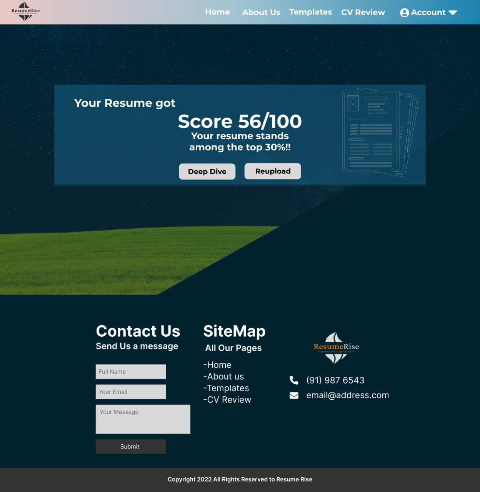

# ResumeRise Frontend
### “Elevate your career with a standout resume.”
> Designed to assist job seekers in creating a professional-looking and effective resume and typically offer a variety of features and tools to help users craft a resume that will stand out to potential employers. Users will have access to a user-friendly interface, where they can input their personal and professional information, customize their resume templates, and create a unique and professional resume

## Features
- Providing resume validation and scoring (whether the resume be shortlisted or not)
- Having multiple templates, gives candidate to tailor their resume to the specific job they are applying for
- Easy and real time updation of resume anytime

## Benefits
- Simplest and effective tool to resume writing doesn't require professionality in writing
- Inexperienced people can also create a professional resume
- User will get a score based on his/her resume that whether it will be shortlisted or not
- Resume will be stored in the website for lifetime
- User can download resume in multiple formats and can be shared directly using Email
- Easy login using multiple social media apps.

## Installation and SetUp Guide
### To clone the Git Repository
Clone the repository to create a local copy on your computer and sync between the two locations. Above the list of files, click  Code(marked in green colour). Copy the URL for the repository using HTTPS, under "HTTPS" and then open the git bash. Type git clone, and then paste the copied URL. Finally the repository is cloned and now can be worked on in the local systems as well. 

## Install Dependencies and run
#### `npm i`
To install the node modules

#### `npm start`
To run the code. In the terminal, the provided url of the running instance (usually http://localhost:3000 unless something else running).

## SignUp, Login Page and OTP for Verification

> SignUp Page for the users visiting our website the first time 

> Otp sent to email for verificaaation after signing up 

> Login Page for the already registered users

## Various Templates according to User's Choice

> Various Templates are provides for the choice and the user can get refined Templated according to the Profession and Skills.

> Some Templates from our website with dynamiccaly updating the website

> Some Templates from our website with dynamiccaly updating the website

> Some Templates from our website with dynamiccaly updating the website

## To Review the Resume 

## Room for Improvement
- This website will provide various formatting tools, such as font and text size options, to help users create a visually appealing resume.
- This website will also provide with the option to import data from the different social networking accounts, which will eventually save time and effort of the user.
- Expand our AI/ML Model.
- Add more templates to go through.
- Can search the selected resumes according to the Company.
- Suggest action verbs as it is very time consuming.

## Acknowledgements

